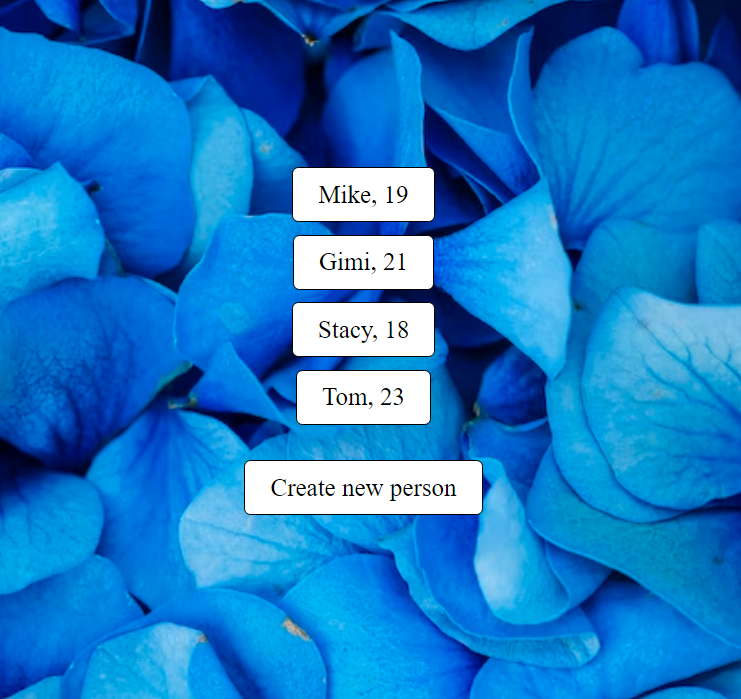
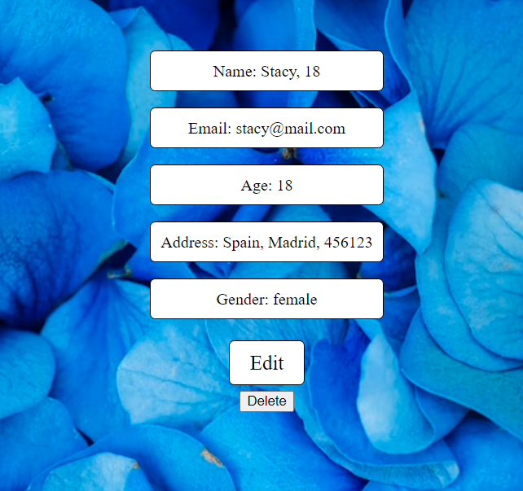

# spring-learning
##First CRUD application
The main thing about this application it's a connected DB(PostgreSQL); everything was used with Spring Boot; validation of filling fields;
dropdown list, while choosing gender and also I used some HTML code for better perception of this application.

